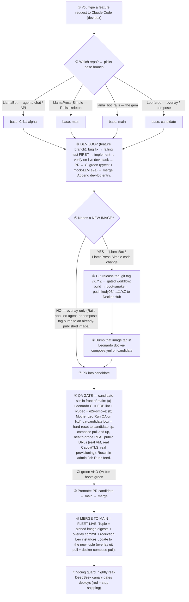

# Release Flow: feature request → production fleet

The full lifecycle, from typing a feature request to Claude Code on the dev box
all the way to running on production Leo instances. High level, one step at a
time.

**Companion docs:** [SHIPPING.md](SHIPPING.md) (pipeline mechanics),
[TESTING.md](TESTING.md) (what to test when), [QA_STAGING.md](QA_STAGING.md)
(the candidate QA gate).

## Diagram



## Diagram (ASCII fallback)

```
┌───────────────────────────────────────────────────────────────────────┐
│ ① YOU type a feature request to Claude Code (on the dev box)            │
└───────────────────────────────────────────────────────────────────────┘
                                   │
                                   ▼
┌───────────────────────────────────────────────────────────────────────┐
│ ② Which repo does it touch?  → picks the base branch                    │
├───────────────┬────────────────────┬─────────────────┬─────────────────┤
│  LlamaBot     │  LlamaPress-Simple  │  llama_bot_rails │   Leonardo      │
│ agent/chat/API│  Rails skeleton     │  the gem         │ overlay/compose │
│ base:         │  base: main         │  base: main      │ base:           │
│  0.4.1-alpha  │                     │                  │  candidate      │
└───────────────┴────────────────────┴─────────────────┴─────────────────┘
                                   │
                                   ▼
┌───────────────────────────────────────────────────────────────────────┐
│ ③ DEV LOOP  (feature branch, on the dev box)                  [DEV BOX] │
│   • bug fix → write the failing test FIRST                              │
│   • implement the change                                               │
│   • verify on the LIVE dev stack (docker-compose-dev.yml)              │
│   • open PR → babysit CI: pytest + browser smoke + mock-LLM e2e        │
│   • append a dev-log entry (docs/dev_logs/<version>)                   │
└───────────────────────────────────────────────────────────────────────┘
                                   │  CI green + reviewed → merge PR
                                   ▼
┌───────────────────────────────────────────────────────────────────────┐
│ ④ Does this change need a NEW IMAGE?                                    │
└───────────────────────────────────────────────────────────────────────┘
            YES │                                       │ NO
   (LlamaBot or LlamaPress-Simple        (overlay-only: Rails app, leo agent,
        CODE change)                      or bumping a compose tag to an
            │                             already-published image)
            ▼                                            │
┌────────────────────────────────────┐                  │
│ ⑤ CUT A RELEASE TAG       [DEV BOX] │                  │
│   git tag vX.Y.Z && git push        │                  │
│   → gated workflow runs:            │                  │
│     build → boot-smoke →            │                  │
│     push kody06/…:X.Y.Z to Docker   │                  │
│     Hub   (never push images by hand)│                 │
└────────────────────────────────────┘                  │
            │                                            │
            ▼                                            │
┌────────────────────────────────────┐                  │
│ ⑥ Bump that image tag in Leonardo's │                  │
│   docker-compose.yml on `candidate` │                  │
└────────────────────────────────────┘                  │
            │                                            │
            └──────────────────────┬─────────────────────┘
                                   ▼
┌───────────────────────────────────────────────────────────────────────┐
│ ⑦ LAND ON `candidate`  (PR into the candidate branch)         [DEV BOX] │
└───────────────────────────────────────────────────────────────────────┘
                                   │
                                   ▼
┌───────────────────────────────────────────────────────────────────────┐
│ ⑧ THE QA GATE  (candidate sits in front of main)                        │
│   a. Leonardo CI: ERB lint + RSpec + e2e-smoke           [DEV BOX]      │
│   b. Mother Leo "Run QA" on the lxd4 qa-candidate box:   [MOTHER LEO]   │
│      hard-reset to candidate tip → docker compose pull && up -d →       │
│      health-probe the REAL public URLs                                  │
│      (real VM node, real two-layer Caddy/TLS, real provisioning —       │
│       the things GitHub Actions can't exercise)                         │
│      → result lands in the mothership admin "Job Runs" feed             │
└───────────────────────────────────────────────────────────────────────┘
                                   │  CI green  AND  QA box boots green
                                   ▼
┌───────────────────────────────────────────────────────────────────────┐
│ ⑨ PROMOTE:  PR `candidate → main`  →  MERGE                   [DEV BOX] │
└───────────────────────────────────────────────────────────────────────┘
                                   │
                                   ▼
┌───────────────────────────────────────────────────────────────────────┐
│ ⑩ MERGE TO MAIN  =  FLEET-LIVE                                          │
│   The deploy tuple = (pinned image digests + the overlay git commit).  │
│   Production Leo instances update to the new tuple                      │
│   (overlay git pull + docker compose pull of the pinned images),        │
│   coordinated by Mother Leo / the update-checker.        [MOTHER LEO]   │
└───────────────────────────────────────────────────────────────────────┘
                                   │
                                   ▼
        Ongoing guard: nightly real-DeepSeek canary gates deploys
        (red canary = stop shipping, even if everything above was green)
```

## The three gates (the spine of it)

| Gate | When | Catches |
|---|---|---|
| **PR CI** (pytest + mock-LLM e2e) | every PR, every repo | logic regressions, broken plumbing, UI/WS breakage |
| **QA box on `candidate`** | before promotion to main | "does this exact tuple even boot on a real VM" — real node, TLS, provisioning |
| **Nightly real-LLM canary** | nightly + on-demand | prompt/model drift; gates whether it's safe to ship at all |

## Who owns what

- **Dev box (you + Claude):** steps ① → ⑨ — the code, the tests, the image tags,
  landing on `candidate`, the promote PR. Never touches prod infra.
- **Mother Leo:** the QA box (⑧b) and the fleet rollout (⑩) — the VM, DNS,
  Caddy/TLS, secrets, running QA. Never pushes to the repos.

## The one fork that matters (step ④)

This is the whole reason there are two paths:

- **Overlay-only** (Rails app, the leo agent, or pointing at an image that
  already exists) → skip the release entirely, PR straight into `candidate`.
- **LlamaBot or skeleton code** → first bake a new image (⑤), then point
  `candidate` at it (⑥).

Either way everything converges on `candidate` and goes through the same QA gate.

## Repo / base-branch quick reference

| Change | Repo | Base branch |
|---|---|---|
| Agent runtime, websocket, FastAPI, LangGraph agents | LlamaBot | `0.4.1-alpha` |
| Rails skeleton: Gemfile, npm, Dockerfile, base Rails | LlamaPress-Simple | `main` |
| The Rails engine gem | llama_bot_rails | `main` |
| Overlay Rails code, leo agent, compose, e2e tests | Leonardo | `candidate` |
